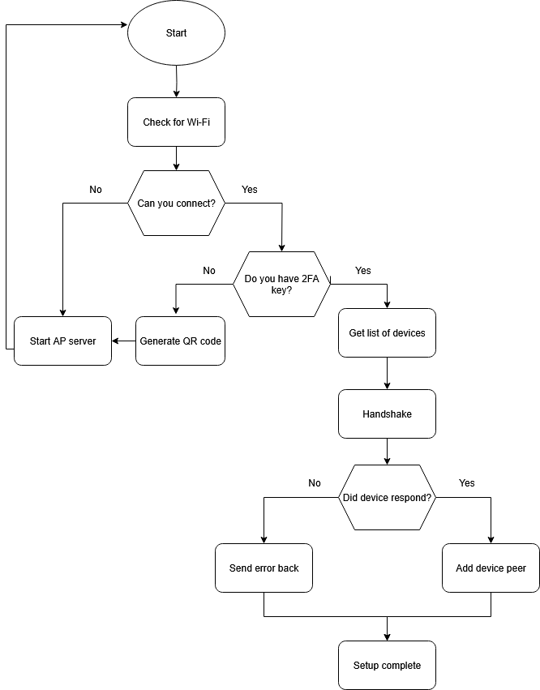

# GrowByte Firmware

This directory contains the firmware for the GrowByte system, designed to run on an ESP32 Xiao C6 microcontroller. The firmware enables the GrowByte hub to connect with soil sensor clients, relay data to a remote server, and support secure onboarding and configuration.

## Hardware Overview

- **Hub:** ESP32 Xiao C6 microcontroller
  - RBG Led to show state
  - Button to factory reset credentials
- **Client:** ESP32 Xiao C6 microcontroller
  - Soil sensor Probe

## System Architecture

- **Soil Sensors (Clients):**  
  - Gather soil data.
  - Send data wirelessly to the hub using ESP-NOW.

- **Hub:**  
  - Receives data from clients.
  - Forwards data to the cloud/server via Wi-Fi.
  - Handles onboarding, configuration, and secure communication.

---

## Firmware Boot/Onboarding Flow

<div align="center">
  
</div>

**Explanation:**
1. **Check for WiFi Credentials:**  
   - If not found, the hub starts an access point (AP) and web server to allow the user to add WiFi credentials.
2. **Check for 2FA Key:**  
   - If absent, the hub generates a QR code and starts an AP/web server to display it for secure onboarding.
3. **Device Discovery:**  
   - Once WiFi and 2FA are configured, the hub retrieves a list of client devices and sends a handshake (including the hub’s MAC address) via ESP-NOW.
4. **Setup Complete:**  
   - The hub is now ready to forward soil sensor data to the server.

---

## Building and Flashing

1. **Dependencies:**  
   - PlatformIO or Arduino IDE  
   - ESP32 board support  
   - Required libraries: `esp_now`, `WiFi`, `QRCode`, `WebServer` and 'HTTP'

2. **Build Steps:**  
   - Clone this repository.
   - Open the `firmware` directory in your IDE.
   - Select the ESP32 Xiao C6 board.
   - Build and upload the firmware to your device.

3. **Configuration:**  
   - On first boot, connect to the hub’s AP (`GrowByte-Setup`) and follow the web instructions to add WiFi credentials and scan the 2FA QR code.

---

## Directory Structure

```
firmware/
  ├── src/
  ├── include/
  ├── platformio.ini / .ino files
  └── README.md
```

---

## Protocols Used

- **ESP-NOW** – Low-latency, peer-to-peer wireless communication between hub and soil sensors.
- **Wi-Fi** – For cloud/server communication and user onboarding.
- **2FA/QR Code** – Secure onboarding for device authentication.

---


## Contact

For questions or support, open an issue or contact [@Caleb-Ellefson](https://github.com/Caleb-Ellefson).


